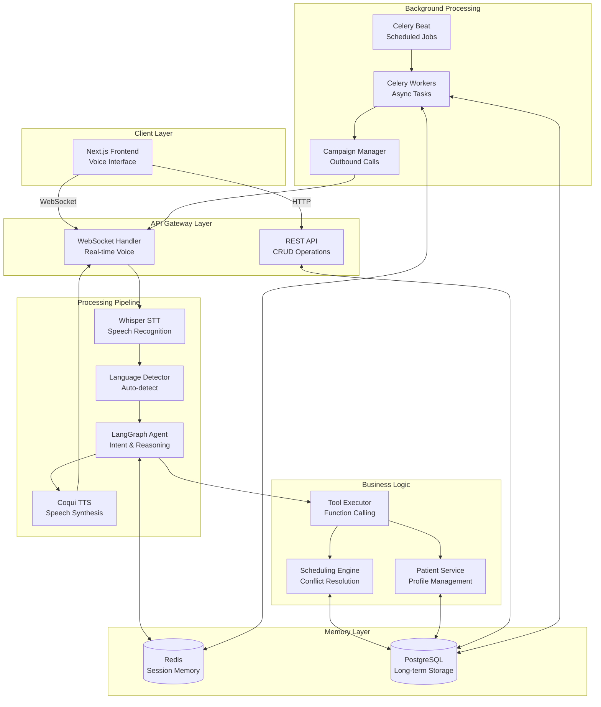

# System Architecture - Clinical Voice AI

## High-Level Architecture



## Component Details

### 1. Frontend (Next.js + TypeScript)
- **VoiceInterface Component**: Main UI with recording controls
- **WebSocket Service**: Real-time bidirectional communication
- **API Service**: REST client for CRUD operations
- **State Management**: Zustand for voice state
- **Audio Processing**: Web Audio API for capture/playback

### 2. Backend (FastAPI + Python)
- **WebSocket Handler**: Manages voice sessions
- **REST API**: Appointment/patient management
- **Async I/O**: High concurrency with asyncio
- **Middleware**: CORS, logging, error handling

### 3. Voice Pipeline
```
Audio Input (WebM/Opus)
    ↓
Base64 Encoding
    ↓
WebSocket Transport
    ↓
Whisper STT (80-120ms)
    ↓
Language Detection (5-10ms)
    ↓
LangGraph Agent (150-200ms)
    ↓
Tool Execution (20-50ms)
    ↓
Coqui TTS (100-150ms)
    ↓
Audio Output (WAV)
```

### 4. Agent Architecture (LangGraph)
```python
StateGraph Flow:
1. understand_intent
   ↓
2. should_use_tools? → Yes → execute_tools
   ↓                    No ↓
3. generate_response ←────┘
   ↓
4. END
```

**Tools Available**:
- check_doctor_availability
- book_appointment
- reschedule_appointment
- cancel_appointment
- get_patient_history

### 5. Memory Architecture

#### Session Memory (Redis)
```json
{
  "session_id": "uuid",
  "patient_id": "P123",
  "language": "hi",
  "intent": "book_appointment",
  "context": {
    "doctor_id": "D456",
    "preferred_date": "2024-01-15"
  },
  "conversation_history": [...]
}
```
- **TTL**: 30 minutes
- **Purpose**: Fast access, temporary state
- **Use Cases**: Active conversations, pending confirmations

#### Long-Term Memory (PostgreSQL)
**Tables**:
- `patients`: User profiles, preferences
- `doctors`: Provider information, specializations
- `appointments`: Booking records
- `availability_slots`: Pre-computed schedules
- `conversation_logs`: Audit trail

**Indexes**:
- B-tree: `appointment.datetime`, `doctor_id`
- Composite: `(doctor_id, date, status)`
- Hash: `patient_id`, `session_id`

### 6. Scheduling Engine

**Conflict Prevention**:
1. Check existing appointments (overlapping time ranges)
2. Verify availability slots
3. Optimistic locking on booking
4. Retry on conflict (max 3 attempts)

**Availability Algorithm**:
```python
for each day in next 30 days:
    for each availability slot:
        for each 30-min interval:
            if no conflict:
                add to available_slots
```

### 7. Background Jobs (Celery)

**Tasks**:
- `send_appointment_reminder`: 24h before appointment
- `schedule_daily_reminders`: Runs daily at midnight
- `outbound_campaign`: Batch calling for follow-ups

**Queue Configuration**:
- Broker: Redis (queue management)
- Backend: Redis (result storage)
- Concurrency: 4 workers
- Rate Limit: 10 tasks/minute

### 8. Interrupt Handling

**Barge-In Flow**:
1. User speaks during AI response
2. Frontend sends `interrupt` control message
3. Backend sets `is_interrupted = True`
4. TTS generation stops
5. New STT processing begins
6. Previous context maintained

## Scalability Considerations

### Horizontal Scaling
- **FastAPI**: Multiple instances behind load balancer (Nginx/ALB)
- **Celery**: Add workers as needed
- **Redis**: Cluster mode for high availability
- **PostgreSQL**: Read replicas for queries

### Vertical Scaling
- **Model Optimization**: Quantized Whisper/TTS models
- **GPU Acceleration**: CUDA for faster inference
- **Connection Pooling**: Reuse DB connections
- **Caching**: Frequent queries in Redis

### Performance Targets
- **Concurrent Users**: 1000+
- **Latency P95**: < 500ms
- **Throughput**: 100 requests/second
- **Uptime**: 99.9%

## Security

- **Authentication**: JWT tokens
- **Encryption**: TLS 1.3 for all connections
- **Data Privacy**: HIPAA compliance considerations
- **Rate Limiting**: Per-user and global limits
- **Input Validation**: Pydantic schemas
- **SQL Injection**: Parameterized queries (SQLAlchemy)

## Monitoring & Observability

- **Metrics**: Prometheus (latency, throughput, errors)
- **Logging**: Structured JSON logs (structlog)
- **Tracing**: OpenTelemetry for distributed tracing
- **Alerts**: Latency > 500ms, Error rate > 1%
- **Dashboards**: Grafana for visualization

## Deployment

### Development
```bash
docker-compose up
```

### Production
- **Container Orchestration**: Kubernetes
- **Service Mesh**: Istio for traffic management
- **CI/CD**: GitHub Actions → ECR → EKS
- **Database**: RDS PostgreSQL Multi-AZ
- **Cache**: ElastiCache Redis Cluster
- **Storage**: S3 for audio logs
